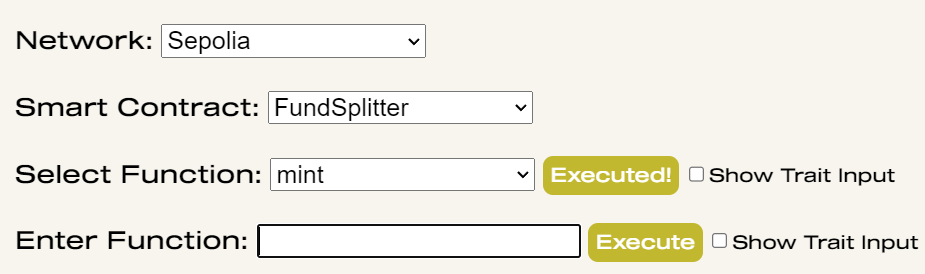

[![Contributors][contributors-shield]][contributors-url]
[![Forks][forks-shield]][forks-url]
[![Stargazers][stars-shield]][stars-url]
[![Issues][issues-shield]][issues-url]
[![MIT License][license-shield]][license-url]
[![LinkedIn][linkedin-shield]][linkedin-url]


<!-- PROJECT LOGO -->
<br />
<p align="center">
  <!--   <a href="https://github.com/EvanGottschalk/SmartContractOperator">
    
  </a> -->
  <a href="https://github.com/EvanGottschalk/SmartContractOperator">
    
  </a>

  <h3 align="center">SmartContractOperator</h3>

  <p align="center">
    A library for simplifying web3 transactions
    <br />
    <a href="https://github.com/EvanGottschalk/SmartContractOperator"><strong>Explore the docs »</strong></a>
    <br />
    <br />
    <a href="https://github.com/EvanGottschalk/SmartContractOperator">View Demo</a>
    ·
    <a href="https://github.com/EvanGottschalk/SmartContractOperator/issues">Report Bug</a>
    ·
    <a href="https://github.com/EvanGottschalk/SmartContractOperator/issues">Request Feature</a>
  </p>
</p>


<br>


<!-- TABLE OF CONTENTS -->
<details open="open">
  <summary><h2 style="display: inline-block">Table of Contents</h2></summary>
  <ol>
    <li>
      <a href="#about-the-project">About The Project</a>
      <ul>
        <li><a href="#built-with">Built With</a></li>
      </ul>
    </li>
    <li>
      <a href="#getting-started">Getting Started</a>
      <ul>
        <li><a href="#prerequisites">Prerequisites</a></li>
        <li><a href="#installation">Installation</a></li>
      </ul>
    </li>
    <li><a href="#usage">Usage</a></li>
    <li><a href="#roadmap">Roadmap</a></li>
    <li><a href="#contributing">Contributing</a></li>
    <li><a href="#license">License</a></li>
    <li><a href="#contact">Contact</a></li>
    <li><a href="#acknowledgements">Acknowledgements</a></li>
  </ol>
</details>


<br>


<!-- ABOUT THE PROJECT -->
## About The Project

`SmartContractOperator` is a library for simplifying web3 transactions.

Interactions with smart contracts can vary widely in their execution and purpose. However, in real world implementations, there are only a handful of common types of transactions, such as a `mint` transaction. These few types of transactions account for 99% of blockchain activity.

Although this list of common transaction types is small, they can all be implemented and customized in myriad ways. All of these different nuances and details can make it cumbersome and complicated to make the most fundamental transactions work in your code. This is where `SmartContractOperator` comes in.

`SmartContractOperator` provides general structures and automated checks to make your life easier, allowing you to easily get your most important transactions working seamlessly and consistently. With `SmartContractOperator`, you can treat all sorts of different `mint` functions as though they are the same, instead of needing to write new code every single time. 


<a href="https://github.com/EvanGottschalk/SmartContractOperator">
  
</a>


<br>


### Built With

* [MetaBoss](https://metaboss.rs/) - this amazing library provides functions for creating and interacting with SPL tokens
* [@solana/web3.js](https://solana-labs.github.io/solana-web3.js/) - this library provides fundamental tools for interacting with the Solana blockchain


<br>


<!-- GETTING STARTED -->
## Getting Started

To get a local copy up and running follow these simple steps.


<br>


### Prerequisites

`SmartContractOperator` requires Node version 18.19.0 or later.


<br>


### Installation

1. Clone this repository
   ```
   git clone https://github.com/EvanGottschalk/SmartContractOperator
   ```
2. Initialize a new Node project
   ```
   yarn init
   ```
3. Install necessary dependencies
   ```
   yarn install
   ```
4. Install Metaboss
   ```
   yarn install metaboss
   ```
5. Run the program
   ```
   npx run scripts/SmartContractOperator.js
   ```


<br>


<!-- USAGE EXAMPLES -->
## Usage

After getting the program running, you can use a test wallet address, or the address from your web wallet. To use your web wallet, first get the private key, and then derive the keypair array using `SmartContractOperator`

Once you have your keypair file, you are ready to go! `SmartContractOperator` can be used to mint NFTs and fungible tokens on Solana's mainnet and devnet.

On devnet, you can use `SmartContractOperator` to request an airdrop and start minting!

On mainnet, you will have to first deposit some SOL into your wallet before you can start minting with `SmartContractOperator`.


<br>


<!-- ROADMAP -->
## Roadmap

See the [open issues](https://github.com/EvanGottschalk/SmartContractOperator/issues) for a list of proposed features (and known issues).

### Upcoming Features

* feature_1
* feature_2
* feature_3


<br>


<!-- CONTRIBUTING -->
## Contributing

Contributions are what make the open source community such an amazing place to be learn, inspire, and create. Any contributions you make are **greatly appreciated**.

1. Fork the Project
2. Create your Feature Branch (`git checkout -b feature/AmazingFeature`)
3. Commit your Changes (`git commit -m 'Add some AmazingFeature'`)
4. Push to the Branch (`git push origin feature/AmazingFeature`)
5. Open a Pull Request


<br>


<!-- LICENSE -->
## License

Distributed under the GNU GPL-3 License. See `LICENSE` for more information.


<br>


<!-- CONTACT -->
## Contact

Evan Gottschalk - [@EvanOnEarth_eth](https://twitter.com/EvanOnEarth_eth) - evan.blockchain@gmail.com

Project Link: [https://github.com/EvanGottschalk/SmartContractOperator](https://github.com/EvanGottschalk/SmartContractOperator)


<br>


<!-- ACKNOWLEDGEMENTS -->
## Acknowledgements

Thinking about contributing to this project? Please do! Your Github username will then appear here.


<!-- MARKDOWN LINKS & IMAGES -->
<!-- https://www.markdownguide.org/basic-syntax/#reference-style-links -->
[contributors-shield]: https://img.shields.io/github/contributors/EvanGottschalk/SmartContractOperator.svg?style=for-the-badge
[contributors-url]: https://github.com/EvanGottschalk/SmartContractOperator/graphs/contributors
[forks-shield]: https://img.shields.io/github/forks/EvanGottschalk/SmartContractOperator.svg?style=for-the-badge
[forks-url]: https://github.com/EvanGottschalk/SmartContractOperator/network/members
[stars-shield]: https://img.shields.io/github/stars/EvanGottschalk/SmartContractOperator.svg?style=for-the-badge
[stars-url]: https://github.com/EvanGottschalk/SmartContractOperator/stargazers
[issues-shield]: https://img.shields.io/github/issues/EvanGottschalk/SmartContractOperator.svg?style=for-the-badge
[issues-url]: https://github.com/EvanGottschalk/SmartContractOperator/issues
[license-shield]: https://img.shields.io/github/license/EvanGottschalk/SmartContractOperator.svg?style=for-the-badge
[license-url]: https://github.com/EvanGottschalk/SmartContractOperator/blob/master/LICENSE.txt
[linkedin-shield]: https://img.shields.io/badge/-LinkedIn-black.svg?style=for-the-badge&logo=linkedin&colorB=555
[linkedin-url]: https://linkedin.com/in/EvanGottschalk
